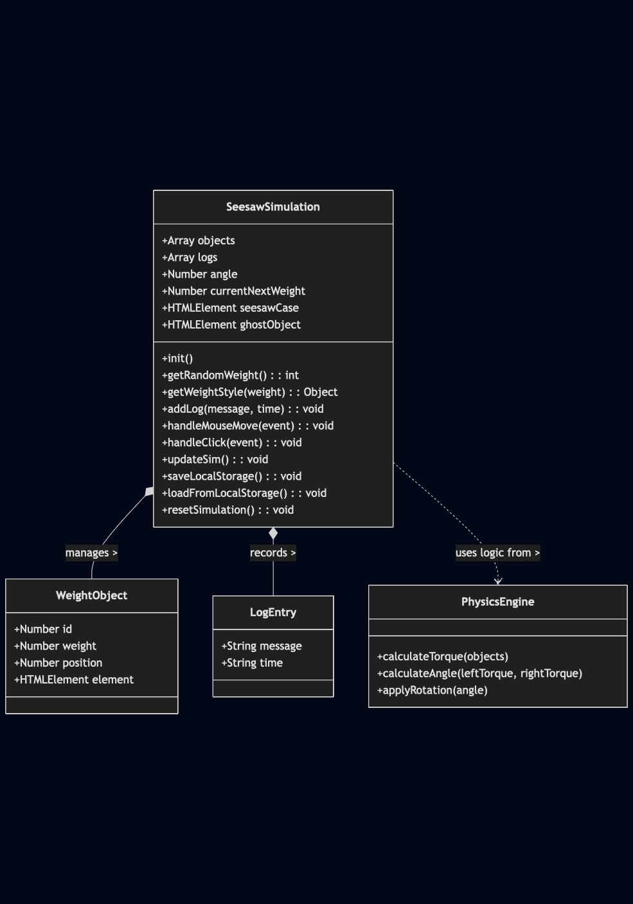

# Seesaw Logic Simulation

A physics-based interactive seesaw simulation built with pure JavaScript, HTML, and CSS. This project demonstrates DOM manipulation, state management, and torque-based physics calculations without using any external libraries.

## Live Demo
[View Live Simulation](https://closedquarts.github.io/seesaw-case/)

## Features
- **Physics Engine:** Calculates torque (`Weight x Distance`) to determine tilt angle dynamically.
- **Persistent State:** Uses `localStorage` to save weights, positions, and activity logs across reloads.
- **Enhanced UX:**
  - **Ghost Preview:** Visual indicator showing exactly where the weight will drop.
  - **Activity Log:** A side panel tracking every move with timestamps.
  - **Visual Feedback:** Weights change color and size based on their mass (Blue < Green < Orange < Red).
  - **Next Weight Preview:** Users can strategize by seeing the upcoming weight.

## Thought Process & Trade-offs

### 1. Hit Area vs. Visual Element
**Challenge:** Clicking on the thin seesaw plank was difficult for users.
**Solution:** I wrapped the seesaw in a larger container and expanded the "hitbox". This allows users to click in the empty space above the plank, creating a realistic "dropping from the sky" feel.

### 2. Physics Sensitivity
**Trade-off:** The simplified formula `Angle = TorqueDiff / 10` caused instant snapping to max angles.
**Decision:** I adjusted the sensitivity divisor to `150`. This creates a smooth, realistic tilting animation that better reflects weight differences.

### 3. Log System & LocalStorage
**Decision:** To make it a complete simulation tool, I added an Activity Log panel. To ensure data persistence, I engineered the `localStorage` logic to save not just the weight positions, but also the log history, restoring the full session state upon reload.

## AI Assistance Declaration
In accordance with the guidelines, I utilized AI tools (Gemini) for:
- Initial scaffolding of the HTML/CSS structure.
- Debugging syntax errors and CSS alignment issues.
- Refactoring `localStorage` logic to handle the log data structure efficiently.
*The core physics logic, state management, and interaction design were implemented and verified by me.*

## How to Run
Simply open `index.html` in any modern web browser. No build step required.

## UML Diagram
